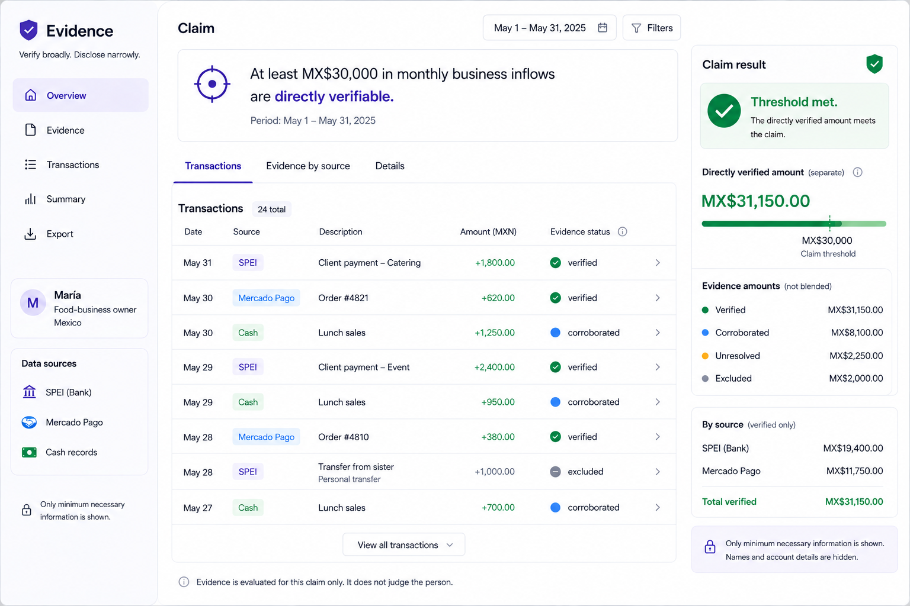

# Evidence MVP — Week 2 Packet

## 1. Problem in my words

Many people earn real income through informal or fragmented channels, but when they need to prove that activity, the evidence is scattered across bank transfers, payment platforms, receipts, messages, and cash transactions. The problem is not necessarily that there is no data; it is that the data is difficult to verify consistently and difficult to turn into evidence that another institution can trust.

Today, systems often respond to this uncertainty by reducing a person to a score. I want to attack a different problem: **how to verify a specific economic claim without judging the person behind it.**

For this MVP, the problem is therefore:

**How can fragmented transaction evidence be turned into a clear, portable, verifiable claim while revealing only the minimum information necessary to support that claim?**

Evidence should act as a **verification layer, not another score**. The system should grade the strength of the evidence without producing a credit score, risk score, or probability of default.

---

## 2. Exact user

The broader user is a **self-employed or micro-business owner in Mexico whose income is real but only partially documented through formal financial records**.

For the MVP, the specific user is **María**, a small food-business owner in Mexico. She receives customer payments through **SPEI, Mercado Pago, and cash**, so her business activity is spread across different types of evidence.

Her immediate goal is to prove one narrow claim:

**At least MX$30,000 in monthly business inflows are supported by evidence.**

The system does **not** judge whether María is a good or bad borrower. It only evaluates how strongly the available evidence supports that specific claim.

---

## 3. Success definition

Before the module closes, the MVP can take María’s evidence from **SPEI, Mercado Pago, and cash records** and evaluate one claim:

**“At least MX$30,000 in monthly business inflows are directly verifiable.”**

The MVP succeeds if it can:

- ingest a small set of sample transactions from María;
- classify each transaction as **verified, corroborated, unresolved, or excluded**;
- distinguish business inflows from clearly irrelevant transfers, such as transfers between María’s own accounts;
- calculate the **directly verified amount separately**;
- show corroborated and unresolved evidence without ever blending it into the verified amount;
- show whether the MX$30,000 claim is supported;
- generate a minimal, human-readable evidence summary without exposing unnecessary personal or relational data.

Success means proving that a narrow economic claim can be evaluated transparently from fragmented evidence.

---

## 4. Image-generated mockup

The approved mockup shows:

- Evidence dashboard
- María as the user
- the MX$30,000 claim
- **Threshold met**
- directly verified amount
- separate evidence categories
- cash activity kept as corroborated unless independently verified
- a narrow evidence summary
- no credit score, risk score, probability of default, or lending recommendation


```markdown
