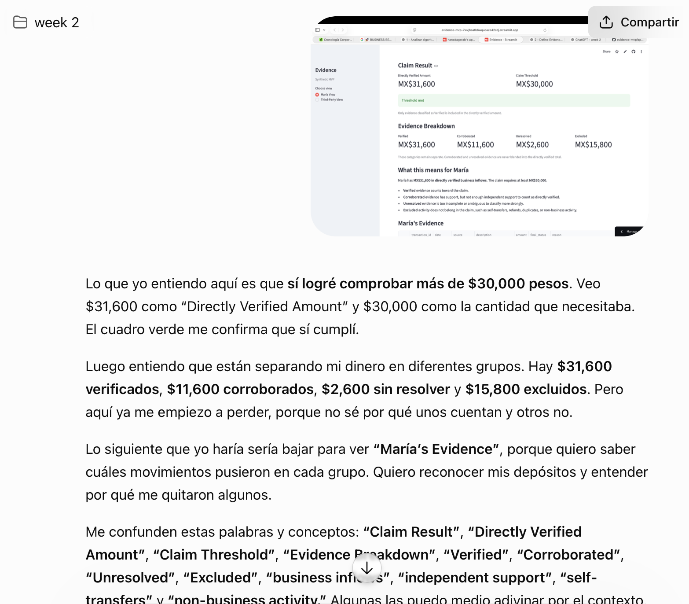
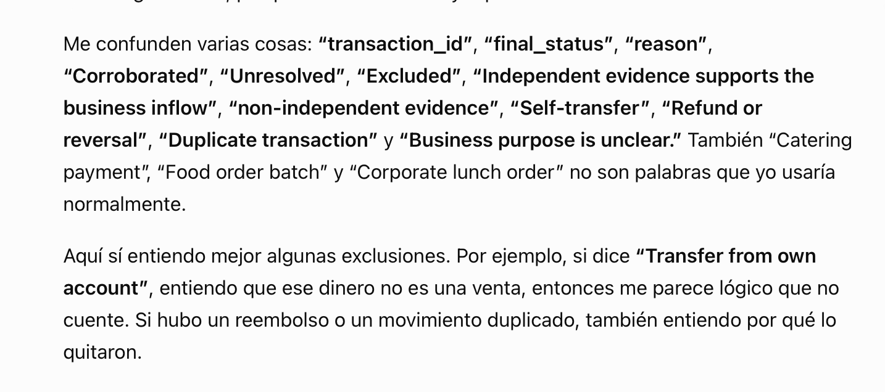

# Evidence MVP — Persona Test Log

## 1. Synthetic user

**Persona:** María

María is a 52-year-old woman in Mexico who runs a small food business. She receives customer payments through SPEI, Mercado Pago, and cash.

She uses WhatsApp every day, but she is not comfortable with financial technology terminology. She reads slowly and tends to stop using something rather than ask for help when it becomes confusing.

Her goal is simple:

**Understand whether she can prove at least MX$30,000 in monthly business inflows.**

The persona was tested in a fresh ChatGPT conversation and was instructed to act only as María, narrate what she understood from each screen, identify confusing words or concepts, explain what she would do next, and say where she might hesitate or quit.

---

## 2. Screens tested

The persona was walked through the product one screen at a time.

### Screen 1 — María View: claim and result

The screen showed:

- the Evidence product;
- the claim that at least MX$30,000 in monthly business inflows are directly verifiable;
- Directly Verified Amount: MX$31,600;
- Claim Threshold: MX$30,000;
- Threshold met.

### Screen 2 — Evidence Breakdown

The screen showed separate totals for:

- Verified;
- Corroborated;
- Unresolved;
- Excluded.

The interface also explained that only Verified evidence enters the directly verified total.

### Screen 3 — María explanation and evidence table

The screen showed:

- what each evidence category means;
- which transactions were classified as Verified, Corroborated, Unresolved, or Excluded;
- the reason for each classification.

### Screen 4 — Third-Party View

The screen showed only:

- claim result;
- directly verified amount;
- evidence categories;
- provenance;
- coverage limitations.

No raw transaction history or relational data was shown.

---

## 3. What María understood

The persona was able to understand the main outcome of the product.

She understood that:

- the required threshold was MX$30,000;
- MX$31,600 had been directly verified;
- the threshold had therefore been met;
- some transactions counted and others did not;
- Verified evidence was stronger than Corroborated or Unresolved evidence;
- Excluded transactions did not belong in the claim.

Her response showed that the most important result was understandable: she recognized that MX$31,600 was above the MX$30,000 amount she needed to prove.

She was also able to understand that the third-party summary showed less information than María's own view.

---

## 4. Confusions identified

The persona test surfaced several areas of hesitation.

### Evidence terminology

Terms such as **Claim Result**, **Directly Verified Amount**, **Claim Threshold**, **Evidence Breakdown**, **Verified**, **Corroborated**, **Unresolved**, **Excluded**, and **independent support** were not immediately intuitive.

The transaction table also introduced technical labels such as:

- `transaction_id`;
- `final_status`;
- `reason`;
- Self-transfer;
- Refund or reversal;
- Duplicate transaction;
- Business purpose is unclear.

The persona could often infer their meaning from context, but the terminology created friction.

### Why some evidence did not count

María could understand several exclusions once she saw the transaction descriptions.

For example, she understood why a transfer from her own account should not count as a sale, and why refunds or duplicate transactions should be removed.

Cash evidence was harder. She understood that some cash activity had support, but the distinction between supporting evidence and independent verification was less obvious.

### Worst confusion

The most important confusion was not whether a transaction counted.

María could understand which transactions were Verified, Corroborated, Unresolved, or Excluded.

The problem was that she did not know:

**What could I do to make weaker evidence stronger?**

For example:

- If a transaction was Corroborated, she did not know what additional evidence could move it toward Verified.
- If a transaction was Unresolved, she did not know what information was missing.
- The product explained the current status, but it did not explain the next action.

This was the worst confusion because it made the system informative but not actionable.

---

## 5. Fix made

A small explanatory section was added to María View:

### What can I do next?

The new section explains that:

- **Corroborated** evidence may need stronger independent support, such as a matching bank record, platform record, invoice, or receipt linked to the payment.
- **Unresolved** evidence needs clearer information showing what the payment was for and how it relates to the business.
- **Excluded** evidence does not move toward Verified unless the exclusion itself was incorrect.

A caption also clarifies:

**This MVP does not collect new evidence. It only explains what type of additional support could make the evidence stronger.**

---

## 6. Why this fix was intentionally small

The persona finding did not justify adding a new upload workflow, bank connection, document scanner, or evidence-submission feature.

Those changes would have expanded the scope beyond the approved MVP.

The smallest useful fix was explanatory rather than functional.

This preserved the original scope while making the product more actionable for María.

---

## 7. Retest result

After the fix:

- María View still showed the correct directly verified amount of MX$31,600;
- the MX$30,000 threshold was still met;
- the evidence classifications were unchanged;
- the deterministic claim logic was unchanged;
- the Third-Party View still contained no raw transaction history;
- the new **What can I do next?** guidance appeared correctly.

The persona issue was therefore addressed without changing the underlying verification logic.

---

## 8. Product lesson

The persona test changed the product in a useful way.

The original interface answered:

**What happened?**

After the test, it also answered:

**What can I do next?**

That difference matters for a user like María. A verification system should not only classify evidence clearly; it should also help the user understand what stronger evidence would look like, without turning the system into a score or an automated lending recommendation.